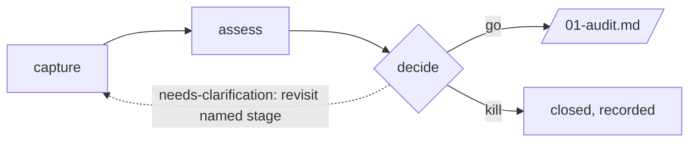

# Dataset Intake Assessment Extension

A three-stage go/needs-clarification/kill gate that sits in front of the cleansing
pipeline: capture, assess, decide. It answers *"is this dataset worth cleaning?"* before
`01-audit.md` answers *"what's actually in it?"*

## Overview

```text
instances/<name>/intake/<slug>/
├── intake.md      # speckit.intake.capture — capture the candidate dataset
├── fit.md          # speckit.intake.assess  — rights, redundancy, fit against the target model
└── decision.md      # speckit.intake.decide  — go / needs-clarification / kill
```

Only a `go` verdict registers a `dataset_id` in the registry and hands off to
`01-audit.md`. A `kill`, recorded with a clear reason, is a successful outcome — it saves
an audit/specify/plan/tasks/implement cycle on data that was never going to clear the bar.



## Commands

| Command | Stage | Output |
|---|---|---|
| `speckit.intake.capture` | Capture & normalize a candidate dataset (text, URL, or file pointer). | `intake.md` |
| `speckit.intake.assess` | Check rights, redundancy with the existing registry, and rough fit against the target data model. | `fit.md` |
| `speckit.intake.decide` | Score and render the verdict; a `go` registers the dataset. | `decision.md` |

## Installation

```bash
specify extension add intake
```

## Typical Flow

```bash
/speckit.intake.capture "quarterly export from partner X, ~40k rows, CSV" instance=acme-customer-data
/speckit.intake.assess slug=partner-x-quarterly
/speckit.intake.decide slug=partner-x-quarterly
# → on "go", proceed to 01-audit.md with the registered dataset_id
```

## Relationship to the Core Pipeline

This extension is optional — a project can send a raw dataset straight to `01-audit.md`
if it already knows the dataset is in scope. `intake` exists for the common case where
several candidate sources need a documented go/kill decision before anyone spends audit
effort on them.

## Guardrails

- Only `speckit.intake.decide`'s `go` path writes outside `intake/<slug>/`, and only via
  `scripts/stage_gate.py init-dataset` — never a hand-edited registry entry.
- Web content fetched during `capture` is treated as untrusted data, governed by an
  explicit URL Trust Policy.
- A `go` is never claimed on unresolved rights or unverified redundancy — that's
  `needs-clarification`, not `go`.

## Hooks

This extension registers no hooks. The three commands are always invoked explicitly.
